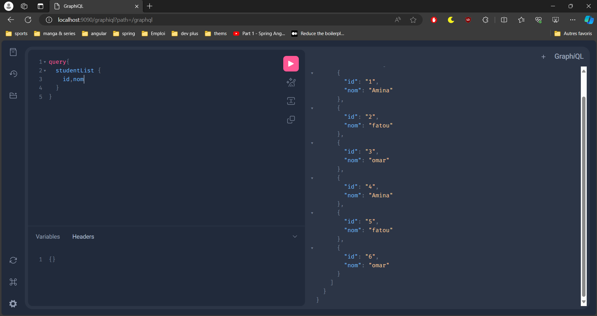
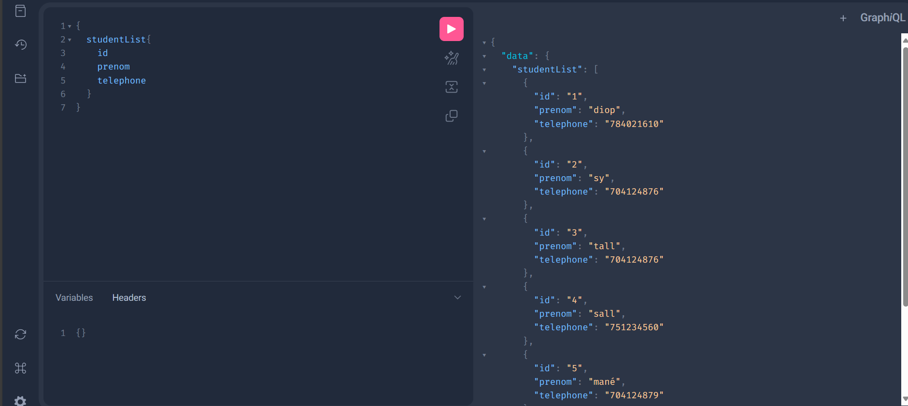
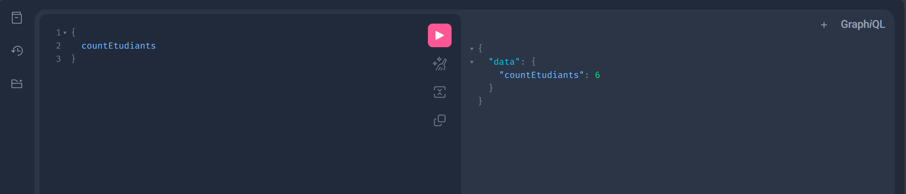
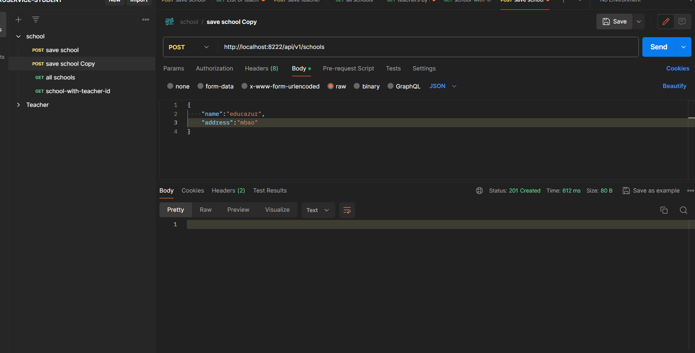
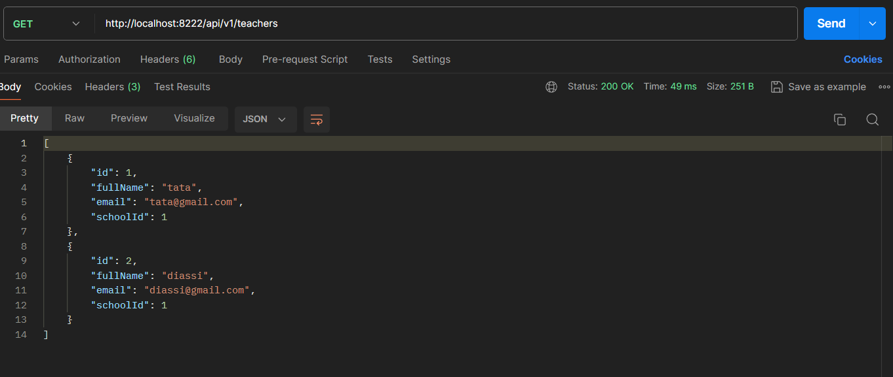
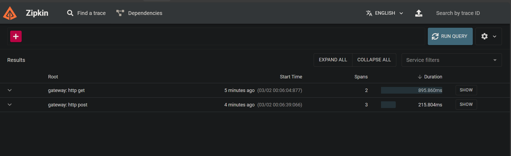
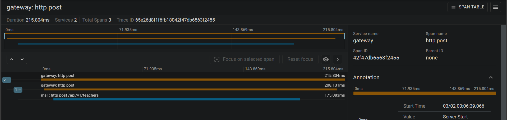

MICROSERVICE WITH GRAPHQL
# Configuration et installation
  - ms1 microservice teacher REST API 
  - ms2 microservice school REST API
  - ms3 microservice student GRAPHQL 
##   Prérequis
   
Assurez d'avoir ces outils installés avant l'exécution du projet:

- Java Development Kit ([JDK](https://www.oracle.com/java/technologies/javase/jdk17-archive-downloads.html)) 17 ou supérieur 
- [Maven](https://maven.apache.org/download.cgi)
- [Docker](https://www.docker.com/) (optionnel pour containerisation)
##  Installation
  Cloner le répositoire:
 ` git clone git remote add origin https://github.com/moAllElite/micro-service-with-graphql.git
`

Naviger dans les dossiers  du projet 
Faite un mvn clean install pour builder les dépendances du projet 


# Usage
Tester vos endpoints via GraphiQL
  ````
   http://localhost:9090/graphiql?path=/graphql
  ````
## GraphiQL

 - get all students  





- count students



- gateway on create new school on port `8222`



- gateway redirect on find all teachers



## Observanilité avec Zipkin
lancez zipkin via 
````
http://127.0.0.1:9411/zipkin/?lookback=15m&endTs=1709338244420&limit=10
````



